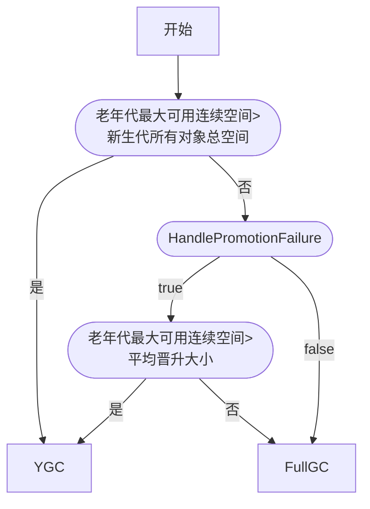

## <center>1.3 JVM</center>

### <center>内存区域</center>
**线程私有:**
1. **程序计数器**: 可以理解为当前**线程**所执行的字节码的**行号指示器**;  
   - **字节码解释器**通过改变程序计数器来依次读取指令，从而实现代码的流程控制;  
   - 在多线程环境下，程序计数器记录当前线程的执行位置，当线程切换时能恢复到正确的执行位置;  

   程序计数器是唯一一个不会出现 OutOfMemoryError 的内存区域;  


2. **虚拟机栈**: **描述的是方法执行的线程内存模型**, 方法调用的数据都是通过栈传递的; 方法调用实际上是栈帧入栈和出栈的过程。  
	由一个个栈帧组成，而每个栈帧中都拥有：局部变量表(主要存放了编译器可知的各种数据类型和对象引用)、操作数栈(保存计算过程的中间结果，作为计算过程中变量临时的存储空间)、动态链接(将符号引用转为直接引用)、方法出口信息;  

	两种异常：StackOverFlowError 和 OutOfMemoryError;  
   - 若虚拟机栈的内存大小**不允许**动态扩展，那么当线程请求栈的深度超过当前栈的最大深度的时候，就抛出StackOverFlowError异常。  
     HotSpot虚拟机的栈容量不能动态扩展, 不会因为无法扩展OOM, 但是线程**申请栈空间时**失败还是会出现OOM;  
   - 若虚拟机栈的内存大小**允许**动态扩展, 动态扩展时，如果无法申请到足够的内存空间, 会抛出OutOfMemoryError异常。  

3. **本地方法栈**  
    HotSpot虚拟机两种栈合二为一;   
    虚拟机栈为虚拟机执行 Java 方法（也就是字节码）服务, 而本地方法栈则为虚拟机用的 Native 方法服务;  
    执行时也会创建栈帧, 存放局部变量表, 操作数栈, 动态链接, 出口信息;   

**线程共享:**    
   - 1.7: 堆 直接内存 方法区-永久代(包含常量池)   
   - 1.8: 堆 直接内存 方法区-元空间   

1. **堆**: 存放对象实例，在经典分代设计中分为：
   - 新生代(Young Generation)  
   Eden 区、Survivor from (s0)区、Survivor to (s1)区  
   对象首先在 Eden 区分配，在一次YGC后，如果对象还存活，则会进入 s0 或者 s1，并且对象的年龄加 1(Eden 区 ==> Survivor 区后对象的初始年龄变为 1)，当它的年龄增加到一定阈值（默认为 15 岁），就会被晋升到老年代中。  
   对象晋升到老年代的年龄阈值，可以通过参数 -XX:MaxTenuringThreshold 来设置。  
   Hotspot遍历所有对象时，按照年龄从小到大对其所占用的大小进行累积，当累积的某个年龄大小超过了survivor区的一半时，取这个年龄和MaxTenuringThreshold中更小的一个值，作为新的晋升年龄阈值。

   - 老年代(Old Generation) 
    
2. **方法区**: 存储被虚拟机加载的类型信息、常量、静态变量、即时编译器编译后的代码缓存等数据 (逻辑区域) 
在HotSpot虚拟机中, 永久代原本是方法区的实现。1.7把字符串常量池和静态变量移出，1.8将剩余的(类型信息等)内容全部移到了元空间，直接使用本地内存。  
在JDK1.8 合并HotSpot和JRockit的时候, JRockit没有永久代; 另外为了让方法区的空间脱离JVM的限制。
**运行时常量池**: 是class文件中每个类、接口的常量池表的运行时表示形式
符号引用和由此而来的直接引用都会存储在这里，另外运行期间的常量也可以放在这里。  
>  - JDK1.7 之前, 运行时常量池包含字符串常量池, 此时hotspot虚拟机对方法区的实现为永久代;  
>  - JDK1.7 字符串常量池从方法区被拿到了堆中, 也就是说字符串常量池被单独拿到堆, 运行时常量池剩下的东西还在方法区(永久代;  
>  - JDK1.8 hotspot移除了永久代用元空间(Metaspace)取代, 这时字符串常量池还在堆, 运行时常量池还在方法区, 只不过方法区的实现从永久代变成了元空间(Metaspace)

3. **直接内存**: 并不是虚拟机运行时数据区的一部分，也不是《Java虚拟机规范》中定义的内存区域。但是这部分内存也被频繁地使用  
    JDK1.4中新加入的 NIO(New Input/Output) 类，引入了一种基于通道（Channel） 与缓存区（Buffer） 的 I/O 方式，它可以直接使用Native函数库直接分配堆外内存，然后通过一个存储在 Java 堆中的 DirectByteBuffer 对象作为这块内存的引用进行操作。这样就能在一些场景中显著提高性能，因为避免了在 **Java 堆**和**Native 堆**之间来回复制数据。


### <center>对象</center>
#### 对象创建
1. **类加载检查**
  虚拟机接收到一条 new 指令时，首先去检查指令的参数能否在常量池中定位到这个类的符号引用，并检查符号引用代表的类是否已被加载、解析和初始化过。如果没有，那必须先执行相应的类加载过程。
2. **分配内存**
  在类加载检查通过后，接下来虚拟机将为新生对象分配内存。对象所需的内存大小在类加载完成后便可确定，为对象分配空间的任务等同于把一块确定大小的内存从 Java 堆中划分出来。
  分配方式有 “指针碰撞” 和 “空闲列表” 两种，选择那种分配方式由堆是否规整决定，而Java堆是否规整又由所采用的垃圾收集器是否带有压缩整理功能决定。 
3. **初始化零值**
  内存分配完成后，虚拟机需要将分配到的内存空间都初始化为零值（不包括对象头），这一步操作保证了对象的实例字段在 Java 代码中可以不赋初始值就直接使用，程序能访问到这些字段的数据类型所对应的零值。  
4. **设置对象头**  
  初始化零值完成之后，虚拟机要对对象进行必要的设置，例如这个对象是哪个类的实例、如何才能找到类的元数据信息、对象的哈希码、对象的 GC 分代年龄等信息。 这些信息存放在对象头中。
5. **执行init方法**  
  执行 new 指令之后会接着执行 init 方法，把对象按照程序员的意愿进行初始化，这样一个真正可用的对象才算完全产生出来。


##### 内存分配的两种方式
- 指针碰撞(内存规整)  
  用过的内存整合到一侧, 没用过的放在另一侧, 中间有一个分界值指针, 只需向没用过的内存方向移动对象内存大小的位置即可.  
  > GC收集器: Serial, ParNew  
- 空闲列表(内存不规整)
  虚拟机会维护一个列表, 列表会记录哪些内存是可用的, 在分配的时候找一块足够大的内存划分给对象实例,更新空闲列表记录.
  > GC收集器: CMS

##### 内存分配时并发问题(保证线程安全的方式
  - CAS+失败重试： CAS 是乐观锁的一种实现方式。所谓乐观锁就是，每次不加锁并假设没有冲突而去完成某项操作，如果因为冲突而失败就重试，直到成功为止。虚拟机采用 CAS 配上失败重试的方式保证更新操作的原子性。
  - TLAB： 为每一个**线程**预先在Eden区分配一块儿内存，JVM在给线程中的对象分配内存时，首先在TLAB分配，当TLAB不够用时，再采用上述的CAS进行内存分配


#### 对象的内存布局
对象在内存中的布局可以分为3块区域：
1. 对象头  
   - 运行时数据(哈希码、GC分代年龄、锁状态标志)  
   - 类型指针(指向类元数据的指针)
2. 实例数据: 对象的属性
3. 对齐填充(占位)  
   Hotspot 虚拟机的自动内存管理系统要求对象起始地址必须是 8 字节的整数倍，就是对象的大小必须是 8 字节的整数倍。


#### 访问定位对象
1. 句柄  
   - 堆上划分一块区域作为句柄池, 栈中的局部变量表引用句柄地址, 句柄包含指向对象的**实例数据和类型数据**的指针 
   - 优势: 对象移动不需要修改reference本身
2. 直接指针 (hotspot默认  
   - 栈中的局部变量表引用直接存储对象地址, 但对象实例需要存储指向类型数据的指针(类型数据在方法区内) 
   - 优势: 省去一次寻址


### <center>GC</center>

#### 对象死亡的判断依据
- 引用计数法
  对象中添加一个引用计数器，在面对循环引用的时候非常无力
  
- 可达性分析法
  GC root 和引用链, 当一个对象无法通过引用链到root, 即为不可用
  可作为GCRoots的对象:  
  - 虚拟机栈(栈帧中的本地变量表)中引用的对象
  - 本地方法栈(Native 方法)中引用的对象
  - 方法区中类静态属性引用的对象
  - 方法区中常量引用的对象
  - 所有被同步锁持有的对象
  - 还有其他的

- 最终判定: 不可达对象并非一定被回收
  - 第一次筛选
  不可达的对象会被筛选一次, 条件是是否有必要执行finalize(). 如果对象没有重写finalize()或finalize()已经被虚拟机调用过, 将被视为没必要执行, 对象被回收.
  - 第二次筛选
  对象放到F-Queue队列中, 并交由一个低优先级的Finalizer线程去执行. 如果在F-Queue中的对象与引用链建立了引用, 将会移出回收队列.
- 三色算法
  - 白色：没有被收集器访问过
  - 黑色：收集器访问过且它的引用都被访问过
  - 灰色：收集器访问过且它的引用至少有一个没有被访问过

##### 无用类的判断

- 该类的所有实例都被回收
- 加载该类的ClassLoader已经回收
- 该类对应的 java.lang.Class 对象没有任何地方被引用, 无法在任何地方通过反射访问该类

#### 垃圾收集算法

##### GC 种类及区域
- Partial GC: 部分
  - Young GC: 只收集young gen
  - Old GC: 只收集old gen 只有CMS的concurrent collection是这个模式
  - Mixed GC: 整个young gen 和部分 old gen 只有G1是这个模式, (也就是说其他的垃圾回收器需要配合
- Full GC: 收集整个堆

**触发条件**:
- 非并发GC(连续GC):  
  - young GC: eden区满了触发
  - full GC: young GC的平均晋升大小比剩余的old gen空间大, 不进行young gc, 触发full gc; 或者永久代空间不够, 同样;  

- 并发GC:  
  CMS GC为例, 它定时检查old gen的使用量, 当使用量超过触发比例就进行GC, 对old gen收集.

**分配担保机制**
虚拟机会检查老年代最大可用的连续空间是否大于新生代所有对象的总空间，
如果小于，则虚拟机会查看HandlePromotionFailure设置值是否允许担保失败。
  如果HandlePromotionFailure=true，那么会继续检查老年代最大可用连续空间是否大于历次晋升到老年代的对象的平均大小，
    如果大于，则尝试进行一次Minor GC，但这次Minor GC依然是有风险的；
    如果小于或者HandlePromotionFailure=false，则改为进行一次Full GC。



##### 分代回收  
> -Xmn: 新生代大小; -Xms: 最小堆空间; -Xmx: 最大堆空间; 
> -XX:MaxTenuringThreshold=threshold(15)  

新生代GC一次年龄加1, 默认阈值15( 超过survivor区一半空间大小的年龄>15 ? 15 : 该年龄 );  
- GC会清空Eden和From，将里面的对象分配到To
- 交换From和To, 令To变成空的
- 直到To被填满, 填满后全部移动到老年代（因为此时到达阈值了）
> 首先在Eden区分配
> 大对象(eden区一半？)直接进入老年代(防止因分配担保机制带来的复制而降低效率)

##### 垃圾回收算法
- **标记-清除算法**(CMS)
  效率问题(寻找可用空间) 空间碎片问题
- **标记-复制算法**(新生代默认)
  将内存分为大小相同的两块, 每次使用一块, 用完后将存活的对象复制到另一块。（空间利用问题）
- **标记-整理算法**(老年代默认)
  标记过程与“标记-清除”算法一样，然后让所有存活的对象向一端移动，直接清理掉端边界以外的内存。（效率问题）
- **分代收集算法**
  在新生代中，每次收集都会有大量对象死去，所以可以选择”标记-复制“算法，只需要付出少量对象的复制成本就可以完成每次垃圾收集。  
  而老年代的对象存活几率是比较高的，而且没有额外的空间对它进行分配担保，所以我们必须选择“标记-清除”或“标记-整理”算法进行垃圾收集。


#### 垃圾回收器
> java -XX:+PrintFlagsFinal -version
> java -XX:+PrintCommandLineFlags -version

**新生代版本**
- **Serial 收集器**  
串行, 单线程  
新生代采用标记-复制算法，老年代采用标记-整理算法。  

- **ParNew 收集器**  
多线程版的 serial, 只有它和serial能与CMS配合工作.

- **Parallel Scavenge 收集器**  
跟parNew差不多, 但关注点是控制吞吐量(运行用户代码与CPU总耗时之间的比例). 1.8默认的之一
可以开启GC的自适应调节策略，将内存管理的调优策略交由收集器
只能与 serial old 和 parallel old 合作

**老年代版本**
- **Serial Old 收集器**  
serial的老年代版本 

- **Parallel Old 收集器**
parallel scavenge的老年代版本

- **CMS(Concurrent Mark Sweep) 收集器**  
  以获取最短回收停顿时间为目标. 第一款并发收集器, 第一次实现了垃圾收集线程和用户线程同时工作.   
  CMS 收集器是 “标记-清除” 算法实现的, 执行过程:
   - **初始标记**: 暂停所有的其他线程，并记录下直接与 root 相连的对象，速度很快  
   - **并发标记**: 同时开启 GC 和用户线程，用一个闭包结构去记录可达对象。用户线程会不断地更新引用域，所以 GC 线程无法保证可达性分析的实时性, 会跟踪记录这些发生引用更新的地方。
   - **重新标记**: 为修正并发标记期间因为用户线程运行导致的标记变动，这个阶段的停顿时间一般会比初始标记阶段的时间稍长，远远比并发标记阶段时间短
   - **并发清除**: 开启用户线程，同时 GC 线程开始对未标记的区域做清扫  

   - 优点: 并发收集 低停顿
   - 缺点: 
     - 对 CPU 资源敏感 GC线程数=(CPU数 + 3) / 4 ；
     - 无法处理浮动垃圾；并发收集阶段产生的垃圾只能下一次GC处理，所以需要预留空间给并发收集时使用，如果预留空间不足会回收失败，使用serial old
     - 使用的回收算法-“标记-清除” 算法会导致大量空间碎片产生。可以设置进行内存空间整理，但是合并过程不能并发

     
**G1(Garbage-First) 收集器**
是一款面向服务器的垃圾收集器, 主要针对配置多处理器及大内存的机器. 低停顿 & 高吞吐量  
把堆划分成了多个大小相等的region，评估region里的垃圾价值(回收获得的空间大小和耗费的时间)，维护了一个价值列表, 根据每次允许的收集时间, 优先选择回收价值最大的区域
对于region之间引用的问题，每个region中都有一个remembered set，如果region中的对象被引用，就维护在set中，可达性分析时将set加入到GC root中
  

G1的回收过程分为以下四个步骤：
- 初始标记：标记GC ROOT能关联到的对象，需要STW
- 并发标记：从GCRoots的直接关联对象开始遍历整个对象图的过程，扫描完成后还会重新处理并发标记过程中产生变动的对象
- 最终标记：短暂暂停用户线程，再处理一次，需要STW
- 筛选回收：更新Region的统计数据，对每个Region的回收价值和成本排序，根据用户设置的停顿时间制定回收计划。再把需要回收的Region中存活对象复制到空的Region，同时清空旧的Region。需要STW  


**CMS 与G1的区别**：在最后的清除过程中一个并发一个不并发；一个标记复制一个标记清除；在二次标记的过程中的算法不同，一个增量更新一个原始快照

并发标记时引用变动的处理
- 增量更新：黑色对象在新增白色引用后变为灰色
- 原始快照：灰色对象在删除白色引用后重新扫描


### <center>类文件结构</center>  
> jclasslib插件可以查看class文件结构

Class 文件通过 ClassFile 定义
大体分8部分: 魔法值、版本号、常量池、类访问标记、继承和实现关系、字段表、方法表、属性表
```
  ClassFile {
    u4             magic; //Class 文件的标志

    u2             minor_version; //Class 的小版本号
    u2             major_version; //Class 的大版本号 java 版本号

    u2             constant_pool_count; //常量池的数量
    cp_info        constant_pool[constant_pool_count-1];  //常量池

    u2             access_flags;  //Class 的访问标记

    u2             this_class;  //当前类
    u2             super_class; //父类
    u2             interfaces_count;  //接口    
    u2             interfaces[interfaces_count];  //一个类可以实现多个接口

    u2             fields_count;  //Class 文件的字段个数
    field_info     fields[fields_count];//一个类会可以有多个字段

    u2             methods_count;//Class 文件的方法数量
    method_info    methods[methods_count];//一个类可以有个多个方法

    //在 Class 文件，字段表，方法表中都可以携带自己的属性表集合
    u2             attributes_count;//此类的属性表中的属性数
    attribute_info attributes[attributes_count];//属性表集合 
  }
```


### <center>类加载机制</center>
#### 类加载过程
类加载，然后验证数据，然后分配内存并且初始类变量值，替换符号引用，调用clinit
```
  1加载
  ==> 2连接 (验证==> 准备==> 解析)
  ==> 3初始化

  ==> 使用==> 卸载
```

1. **加载**:
   - 通过全类名获取定义此类的二进制字节流 
   > 此时是可控性最强的阶段, 可以自定义类加载器控制字节流的获取方式(重写类加载器的loadClass()方法)
   - 将字节流所代表的静态存储结构转换为方法区的运行时数据结构
   - 在内存中生成一个代表该类的 Class 对象，作为方法区这个类的各种数据的访问入口  
2. **连接**:  
   2.1 **验证**: 确保字节流中的信息符合虚拟机要求，并且不会危害虚拟机安全。  
    - 文件格式验证: Class文件格式规范；这时候会讲字节流转化成方法区的数据格式
    - 元数据验证: 对类的元数据信息进行语义校验, 确保符合Java语言规范
    - 字节码验证: 最复杂的, 通过数据流和控制流分析, 确定程序语义合法
    - 符号引用验证: 发生在虚拟机将符号引用转化为直接引用的时候(解析时发生)，确保解析动作能正确执行  
	
   2.2 **准备**:
    分配内存并设置类变量初始值的阶段(如果是final修饰, 此时就会被赋具体值)  
  
   2.3 **解析**: 这一步的时间时不确定的
    将常量池内的符号引用替换为直接引用的过程

3. **初始化**  
   是执行类构造器 clinit () 方法的过程。带锁线程安全, 会造成线程阻塞  

>  虚拟机严格规范了有且只有 5 种情况下，必须对类进行初始化:  
>  1. new getstatic putstatic invokestatic 
>  2. 使用反射, 需要先初始化
>  3. 父类会在子类初始化之前初始化
>  4. Main{}主类在jvm启动时就会初始化
>  5. MethodHandle和VarHandle可以看作是轻量级的反射调用机制，而要想使用这2个调用， 就必须先使用findStaticVarHandle来初始化要调用的类。
>  6. 当一个接口中定义了JDK8新加入的default方法时，如果有这个接口的实现类发生了初始化，那该接口要在其之前被初始化。
4. 使用
5. 卸载
   也就是对应的Class对象被GC
   1. 该类的所有的实例对象都已被GC，也就是说堆不存在该类的实例对象
   2. 该类没有在其他任何地方被引用
   3. 该类的类加载器的实例已被GC     
      jvm自带的类加载器不会被GC, 自定义的才会被回收; 也就是只有自定义的类加载器所加载的类才会被回收


#### 类加载器  
JVM 中内置了三个重要的 ClassLoader，除了 BootstrapClassLoader 其他两个均由 Java 实现且全部继承自抽象类 java.lang.ClassLoader：
1. BootstrapClassLoader(启动类加载器) ：最顶层的加载类，由C++实现，负责加载 %JAVA_HOME%/lib目录下的jar包和类或者或被 -Xbootclasspath参数指定的路径中的所有类。
2. ExtClassLoader(扩展类加载器) ：extension主要负责加载目录 %JRE_HOME%/lib/ext 目录下的jar包和类，或被 java.ext.dirs 系统变量所指定的路径下的jar包。
3. AppClassLoader(应用程序类加载器) ：面向我们用户的加载器，负责加载当前应用classpath下的所有jar包和类。


##### 双亲委派  
类加载的时候, 首先会把加载的请求委派给**父加载器(注意,不是父类)** 的 loadClass() 处理, 因此所有的请求最终都会交给顶层的启动类加载器 BootstrapClassLoader 处理, 当父加载器无法处理时才自己处理. 当父加载器为 null 时, 会使用启动类加载器 BootstrapClassLoader.
双亲委派可以有效地避免重复加载的问题.


##### 自定义类加载器 
自定义加载器，需要继承抽象类 ClassLoader 。如果我们不想打破双亲委派模型，就重写 findClass() 方法，无法被父类加载器加载的类最终会通过这个方法被加载。但是，如果想打破双亲委派模型则需要重写 loadClass() 方法

