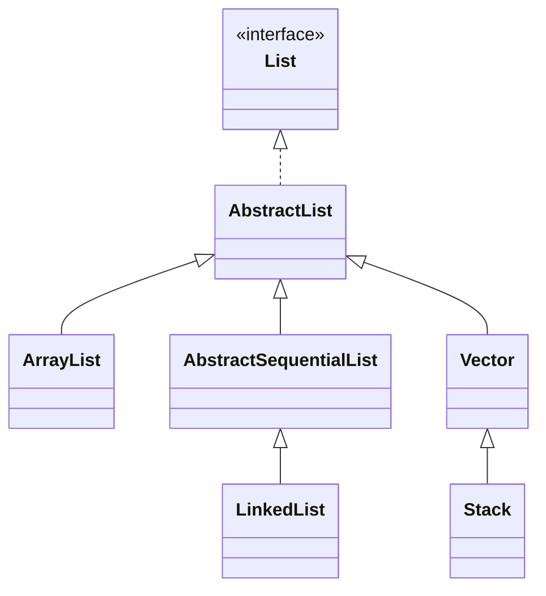
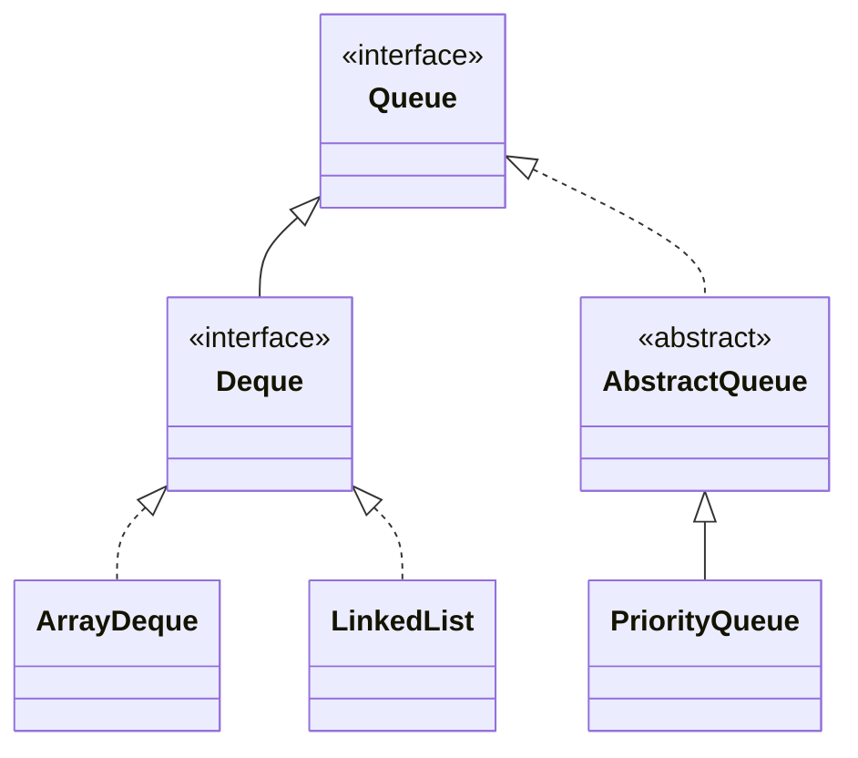
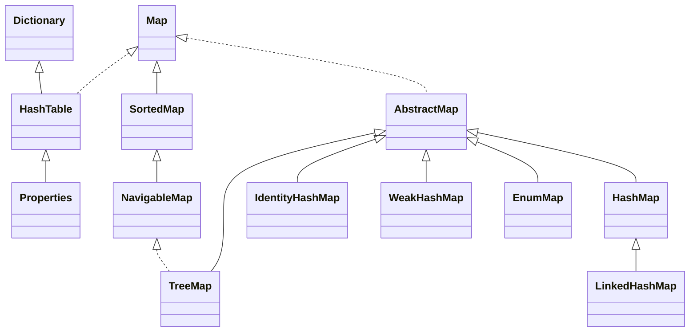
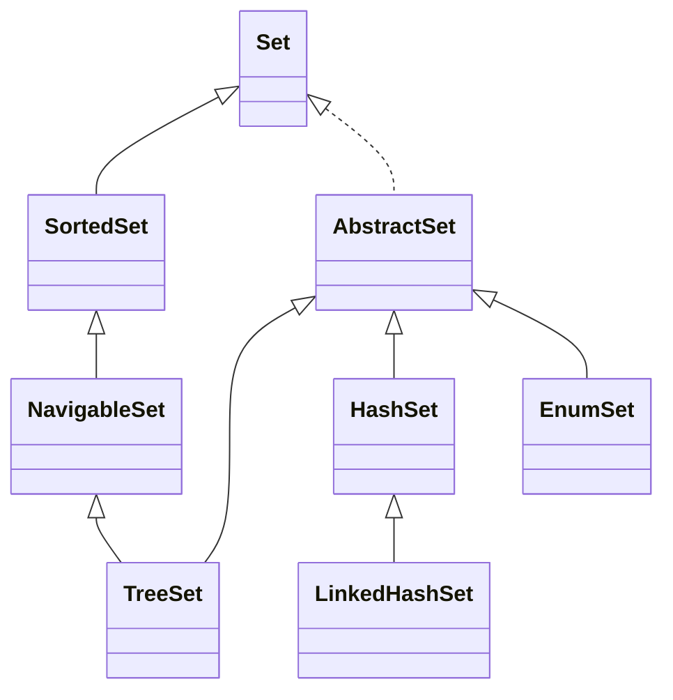
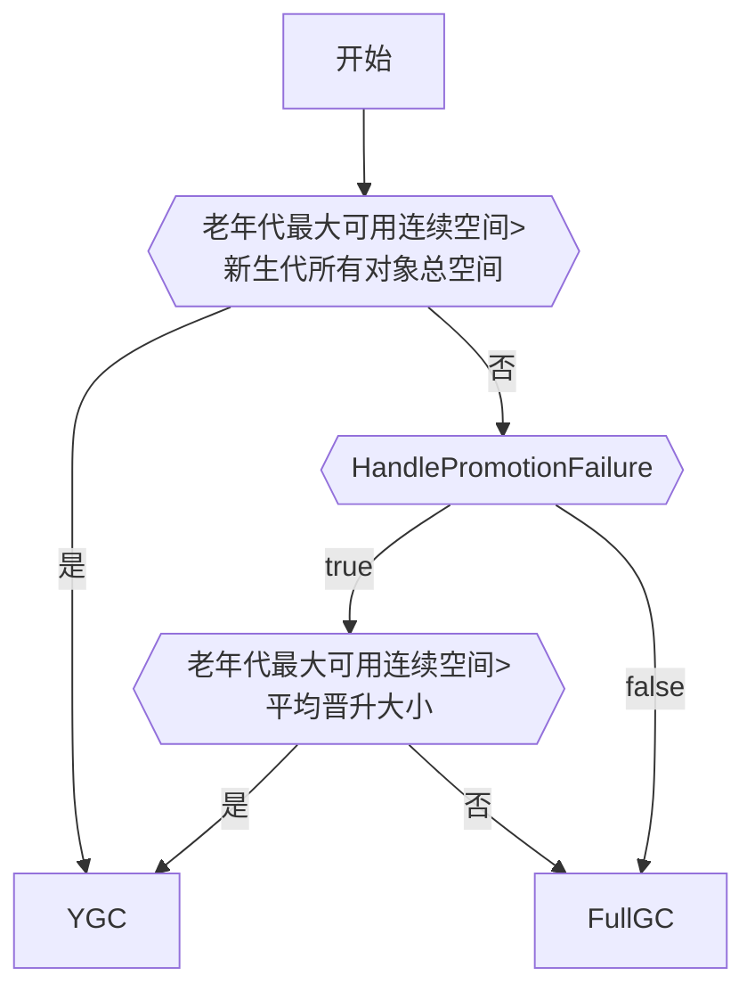
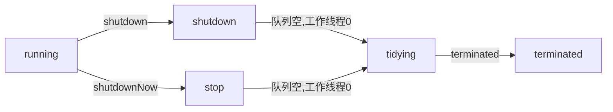

## <center>1.1 基础</center>

### 基本数据类型

| 类型     | 字节 |
| -------- | ---- |
| byte     | 1    |
| short    | 2    |
| int      | 4    |
| long     | 8    |
| **char** | 2    |
| float    | 4    |
| double   | 8    |


### BitSet
BitSet 内部维护了一个 long[] words, 顺序地表示 1 到 (words.length * 64)  
> 每个long占用64位


### Object function
- registerNatives() 类被加载的时候，调用该方法，以完成对其他本地方法的注册
- clone
- equals
- hashCode
- finalize
- toString
- notify
- notifyAll
- wait


### 引用类型  
1. 强引用(永久有效): 只要有强引用指向, 并且GC Roots可达, 那么GC时就不会回收  
2. 软引用(内存不足): OOM前会加入回收范围; 主要用来缓存服务器中间计算结果和不需要实时保存的用户行为等  
3. 弱引用(再次YGC): 指向的对象在下一次YGC时回收  
4. 虚引用(即时失效): 定义完成后就无法通过该引用获取指向的对象. 使用虚引用的唯一目的是希望能在回收时收到系统的通知. 必须与引用队列联合使用, 回收对象内存前会把虚引用加入引用队列中.  


### exception error
exception能被程序本身可以处理，error是程序本身无法处理的。
error通常是虚拟机运行错误

### 受检异常和非受检异常
受检异常：编译时的异常  
非受检异常：RuntimeException和Error


## <center>1.2 集合</center>

### <center>List</center>

- ArrayList  
初始化size=0, add后变成**10**, 1.5倍扩容  

- LinkedList  
双向链表, 头插 | 尾插  

**线程安全的**
- CopyOnWriteArrayList 读的时候不加锁，写的时候加锁复制容器副本，写入并修改其引用
- Collections.synchronizedList(List list) 
- Vector  跟ArrayList类似, 大部分方法被synchronized修饰, 2倍扩容

### <center>Queue</center>

- Queue  
    Queue 一端进一端出  
    Deque 两端均可进出  

    Queue interface 方法:(在空间不足的情况下)

    | runtime exception | no runtime exception |
    | ----------------- | -------------------- |
    | add(E)            | offer(E)             |
    | remove()          | poll()               |
    | element()         | peek()               |

- ArrayDeque  
    - 可扩容数组  
    - 不可存null  
    - 头尾操作高效，通过修改头尾的索引进行操作。
      > head不一定总是大于tail  
    - 内存效率好  

- LinkedList  
    可存null

### <center>Map</center>


- HashMap  
  - 各版本实现方式  
    - 1.7 数组+单链表 
      > 如果一个桶中的元素过多，查询效率就是O(n)  

      1.7 Entry  
      1.7 使用头插法(认为后来的值查找可能性大)  
      > 多线程状态下有可能出现环形链表  

    - 1.8 数组+(单链表|红黑树) 查询效率最差是O(logn)        
      1.8 Node  
      1.8 使用尾插法  
  
  - JDK1.8 关键参数&扩容  
    - 初始化
      ```java
      static final int tableSizeFor(int cap) {
        int n = cap - 1;
        n |= n >>> 1;
        n |= n >>> 2;
        n |= n >>> 4;
        n |= n >>> 8;
        n |= n >>> 16;
        return (n < 0) ? 1 : (n >= MAXIMUM_CAPACITY) ? MAXIMUM_CAPACITY : n + 1;
      }
      ```
    - putVal:
      > 如果table空，resize()
        如果桶里面没有数据，放进去
        如果第一个节点哈希值一样且key一样，说明已经在里面了
        else if 是树节点，往树中添加节点
        else if 是链表，从头到尾遍历，如果没有冲突就放到尾节点（如果大于等于8树形化）
        判断阈值是否要扩容
    - removeNode:
      > 计算index, 如果为空返回null
        如果第一个节点就是, 记录第一个节点
        如果不是, 且next不为null, 判断第1个节点是树节点还是链表节点, 分别进行查找
        最后根据情况删除 
    - resize:
      > if旧容量不为0, 两倍扩容;并且容量到16, 新阈值也加倍
        else if旧容量为0, 旧阈值不为0, 新容量=旧阈值
        else if旧容量为0, 旧阈值为0, 那么都变成默认的    
        if 新阈值为0 (只有旧容量小于16或者旧容量0&阈值不为0的两种情况下出现), 变成默认的
        遍历旧table, 重新做hash散列 


    - 容量
      初始化容量16  
      loadFactor=0.75  
      threshold = capacity * loadFactor = 12
      2倍扩容  

    - (单链表长度 >= 8) & (数组长度 >= 64) 变成红黑树  
      > TREEIFY_THRESHOLD 桶的树化阈值 8  
      > MIN_TREEIFY_CAPACITY 最小树形化容量 64  

    - 红黑树node数量 <= 6 变成单链表  
      > UNTREEIFY_THRESHOLD 树的链表还原阈值 6  
    
  - 桶的树形化 treeifyBin()
    1. 根据Hash表中的元素个数决定是扩容还是树形化
    2. 遍历桶中的元素创建相同个数的树型节点，由单链表转为双链表再转为树形
    3. 让桶的第一个元素指向新建的树头结点  
    
  - put()  
    扩容 首先检测阈值, 扩容成2倍, 重新计算数组中的index = key.hash & (length-1)  
    index = (n-1)&hash, n是数组长度, 是2的幂次方, 则n-1=11111  
    扩容为2倍的情况下，原来的index会在原位置或原位置+原table长度的位置  
    ```
    n-1:    0000 0000 1111
    hash1:  0101 0101 0101  ->  0101
    hash2:  0101 0100 0101  ->  0101

    n-1:    0000 0001 1111
    hash1:  0101 0101 0101  ->  1 0101
    hash2:  0101 0100 0101  ->  0 0101
    ```  

  - 多线程环境下的问题  
    1.7 多线程调用，resize的时候有可能出现环形链表或者数据丢失:  
    未resize之前的节点B在resize的时候头插，而之前这个节点被它之前的节点A指向。这是1.7线程不安全最大的问题之一。  
    1.8 的get/put也没有加同步锁，无法保证多线程操作时上一时刻放进去的值get出来还原值。


### <center>Set</center>

Set是基于Map实现的，map里面的value是：private static final Object PRESENT = new Object();
- LinkedHashSet 加了一条双向链表  
- TreeSet 红黑树，可以有序地组织数据  


## <center>1.3 JVM</center>

### <center>内存区域</center>
**线程私有:**
1. **程序计数器**: 可以理解为当前**线程**所执行的字节码的**行号指示器**;  
   - **字节码解释器**通过改变程序计数器来依次读取指令，从而实现代码的流程控制;  
   - 在多线程环境下，程序计数器记录当前线程的执行位置，当线程切换时能恢复到正确的执行位置;  

   程序计数器是唯一一个不会出现 OutOfMemoryError 的内存区域;  


2. **虚拟机栈**: **描述的是方法执行的线程内存模型**, 方法调用的数据都是通过栈传递的; 方法调用实际上是栈帧入栈和出栈的过程。  
	由一个个栈帧组成，而每个栈帧中都拥有：局部变量表(主要存放了编译器可知的各种数据类型和对象引用)、操作数栈(保存计算过程的中间结果，作为计算过程中变量临时的存储空间)、动态链接(将符号引用转为直接引用)、方法出口信息;  

	两种异常：StackOverFlowError 和 OutOfMemoryError;  
   - 若虚拟机栈的内存大小**不允许**动态扩展，那么当线程请求栈的深度超过当前栈的最大深度的时候，就抛出StackOverFlowError异常。  
     HotSpot虚拟机的栈容量不能动态扩展, 不会因为无法扩展OOM, 但是线程**申请栈空间时**失败还是会出现OOM;  
   - 若虚拟机栈的内存大小**允许**动态扩展, 动态扩展时，如果无法申请到足够的内存空间, 会抛出OutOfMemoryError异常。  

3. **本地方法栈**  
    HotSpot虚拟机两种栈合二为一;   
    虚拟机栈为虚拟机执行 Java 方法（也就是字节码）服务, 而本地方法栈则为虚拟机用的 Native 方法服务;  
    执行时也会创建栈帧, 存放局部变量表, 操作数栈, 动态链接, 出口信息;   

**线程共享:**    
   - 1.7: 堆 直接内存 方法区-永久代(包含常量池)   
   - 1.8: 堆 直接内存 方法区-元空间   

1. **堆**: 存放对象实例，在经典分代设计中分为：
   - 新生代(Young Generation)  
   Eden 区、Survivor from (s0)区、Survivor to (s1)区  
   对象首先在 Eden 区分配，在一次YGC后，如果对象还存活，则会进入 s0 或者 s1，并且对象的年龄加 1(Eden 区 ==> Survivor 区后对象的初始年龄变为 1)，当它的年龄增加到一定阈值（默认为 15 岁），就会被晋升到老年代中。  
   对象晋升到老年代的年龄阈值，可以通过参数 -XX:MaxTenuringThreshold 来设置。  
   Hotspot遍历所有对象时，按照年龄从小到大对其所占用的大小进行累积，当累积的某个年龄大小超过了survivor区的一半时，取这个年龄和MaxTenuringThreshold中更小的一个值，作为新的晋升年龄阈值。

   - 老年代(Old Generation) 
    
2. **方法区**: 存储被虚拟机加载的类型信息、常量、静态变量、即时编译器编译后的代码缓存等数据 (逻辑区域) 
在HotSpot虚拟机中, 永久代原本是方法区的实现。1.7把字符串常量池和静态变量移出，1.8将剩余的(类型信息等)内容全部移到了元空间，直接使用本地内存。  
在JDK1.8 合并HotSpot和JRockit的时候, JRockit没有永久代; 另外为了让方法区的空间脱离JVM的限制。
**运行时常量池**: 是class文件中每个类、接口的常量池表的运行时表示形式
符号引用和由此而来的直接引用都会存储在这里，另外运行期间的常量也可以放在这里。  
>  - JDK1.7 之前, 运行时常量池包含字符串常量池, 此时hotspot虚拟机对方法区的实现为永久代;  
>  - JDK1.7 字符串常量池从方法区被拿到了堆中, 也就是说字符串常量池被单独拿到堆, 运行时常量池剩下的东西还在方法区(永久代;  
>  - JDK1.8 hotspot移除了永久代用元空间(Metaspace)取代, 这时字符串常量池还在堆, 运行时常量池还在方法区, 只不过方法区的实现从永久代变成了元空间(Metaspace)

3. **直接内存**: 并不是虚拟机运行时数据区的一部分，也不是《Java虚拟机规范》中定义的内存区域。但是这部分内存也被频繁地使用  
    JDK1.4中新加入的 NIO(New Input/Output) 类，引入了一种基于通道（Channel） 与缓存区（Buffer） 的 I/O 方式，它可以直接使用Native函数库直接分配堆外内存，然后通过一个存储在 Java 堆中的 DirectByteBuffer 对象作为这块内存的引用进行操作。这样就能在一些场景中显著提高性能，因为避免了在 **Java 堆**和**Native 堆**之间来回复制数据。


### <center>对象</center>
#### 对象创建
1. **类加载检查**
  虚拟机接收到一条 new 指令时，首先去检查指令的参数能否在常量池中定位到这个类的符号引用，并检查符号引用代表的类是否已被加载、解析和初始化过。如果没有，那必须先执行相应的类加载过程。
2. **分配内存**
  在类加载检查通过后，接下来虚拟机将为新生对象分配内存。对象所需的内存大小在类加载完成后便可确定，为对象分配空间的任务等同于把一块确定大小的内存从 Java 堆中划分出来。
  分配方式有 “指针碰撞” 和 “空闲列表” 两种，选择那种分配方式由堆是否规整决定，而Java堆是否规整又由所采用的垃圾收集器是否带有压缩整理功能决定。 
3. **初始化零值**
  内存分配完成后，虚拟机需要将分配到的内存空间都初始化为零值（不包括对象头），这一步操作保证了对象的实例字段在 Java 代码中可以不赋初始值就直接使用，程序能访问到这些字段的数据类型所对应的零值。  
4. **设置对象头**  
  初始化零值完成之后，虚拟机要对对象进行必要的设置，例如这个对象是哪个类的实例、如何才能找到类的元数据信息、对象的哈希码、对象的 GC 分代年龄等信息。 这些信息存放在对象头中。
5. **执行init方法**  
  执行 new 指令之后会接着执行 init 方法，把对象按照程序员的意愿进行初始化，这样一个真正可用的对象才算完全产生出来。


##### 内存分配的两种方式
- 指针碰撞(内存规整)  
  用过的内存整合到一侧, 没用过的放在另一侧, 中间有一个分界值指针, 只需向没用过的内存方向移动对象内存大小的位置即可.  
  > GC收集器: Serial, ParNew  
- 空闲列表(内存不规整)
  虚拟机会维护一个列表, 列表会记录哪些内存是可用的, 在分配的时候找一块足够大的内存划分给对象实例,更新空闲列表记录.
  > GC收集器: CMS

##### 内存分配时并发问题(保证线程安全的方式
  - CAS+失败重试： CAS 是乐观锁的一种实现方式。所谓乐观锁就是，每次不加锁并假设没有冲突而去完成某项操作，如果因为冲突而失败就重试，直到成功为止。虚拟机采用 CAS 配上失败重试的方式保证更新操作的原子性。
  - TLAB： 为每一个**线程**预先在Eden区分配一块儿内存，JVM在给线程中的对象分配内存时，首先在TLAB分配，当TLAB不够用时，再采用上述的CAS进行内存分配


#### 对象的内存布局
对象在内存中的布局可以分为3块区域：
1. 对象头  
   - 运行时数据(哈希码、GC分代年龄、锁状态标志)  
   - 类型指针(指向类元数据的指针)
2. 实例数据: 对象的属性
3. 对齐填充(占位)  
   Hotspot 虚拟机的自动内存管理系统要求对象起始地址必须是 8 字节的整数倍，就是对象的大小必须是 8 字节的整数倍。


#### 访问定位对象
1. 句柄  
   - 堆上划分一块区域作为句柄池, 栈中的局部变量表引用句柄地址, 句柄包含指向对象的**实例数据和类型数据**的指针 
   - 优势: 对象移动不需要修改reference本身
2. 直接指针 (hotspot默认  
   - 栈中的局部变量表引用直接存储对象地址, 但对象实例需要存储指向类型数据的指针(类型数据在方法区内) 
   - 优势: 省去一次寻址


### <center>GC</center>

#### 对象死亡的判断依据
- 引用计数法
  对象中添加一个引用计数器，在面对循环引用的时候非常无力
  
- 可达性分析法
  GC root 和引用链, 当一个对象无法通过引用链到root, 即为不可用
  可作为GCRoots的对象:  
  - 虚拟机栈(栈帧中的本地变量表)中引用的对象
  - 本地方法栈(Native 方法)中引用的对象
  - 方法区中类静态属性引用的对象
  - 方法区中常量引用的对象
  - 所有被同步锁持有的对象
  - 还有其他的

- 最终判定: 不可达对象并非一定被回收
  - 第一次筛选
  不可达的对象会被筛选一次, 条件是是否有必要执行finalize(). 如果对象没有重写finalize()或finalize()已经被虚拟机调用过, 将被视为没必要执行, 对象被回收.
  - 第二次筛选
  对象放到F-Queue队列中, 并交由一个低优先级的Finalizer线程去执行. 如果在F-Queue中的对象与引用链建立了引用, 将会移出回收队列.
- 三色算法
  - 白色：没有被收集器访问过
  - 黑色：收集器访问过且它的引用都被访问过
  - 灰色：收集器访问过且它的引用至少有一个没有被访问过

##### 无用类的判断

- 该类的所有实例都被回收
- 加载该类的ClassLoader已经回收
- 该类对应的 java.lang.Class 对象没有任何地方被引用, 无法在任何地方通过反射访问该类

#### 垃圾收集算法

##### GC 种类及区域
- Partial GC: 部分
  - Young GC: 只收集young gen
  - Old GC: 只收集old gen 只有CMS的concurrent collection是这个模式
  - Mixed GC: 整个young gen 和部分 old gen 只有G1是这个模式, (也就是说其他的垃圾回收器需要配合
- Full GC: 收集整个堆

**触发条件**:
- 非并发GC(连续GC):  
  - young GC: eden区满了触发
  - full GC: young GC的平均晋升大小比剩余的old gen空间大, 不进行young gc, 触发full gc; 或者永久代空间不够, 同样;  

- 并发GC:  
  CMS GC为例, 它定时检查old gen的使用量, 当使用量超过触发比例就进行GC, 对old gen收集.

**分配担保机制**
虚拟机会检查老年代最大可用的连续空间是否大于新生代所有对象的总空间，
如果小于，则虚拟机会查看HandlePromotionFailure设置值是否允许担保失败。
  如果HandlePromotionFailure=true，那么会继续检查老年代最大可用连续空间是否大于历次晋升到老年代的对象的平均大小，
    如果大于，则尝试进行一次Minor GC，但这次Minor GC依然是有风险的；
    如果小于或者HandlePromotionFailure=false，则改为进行一次Full GC。



##### 分代回收  
> -Xmn: 新生代大小; -Xms: 最小堆空间; -Xmx: 最大堆空间; 
> -XX:MaxTenuringThreshold=threshold(15)  

新生代GC一次年龄加1, 默认阈值15( 超过survivor区一半空间大小的年龄>15 ? 15 : 该年龄 );  
- GC会清空Eden和From，将里面的对象分配到To
- 交换From和To, 令To变成空的
- 直到To被填满, 填满后全部移动到老年代（因为此时到达阈值了）
> 首先在Eden区分配
> 大对象(eden区一半？)直接进入老年代(防止因分配担保机制带来的复制而降低效率)

##### 垃圾回收算法
- **标记-清除算法**(CMS)
  效率问题(寻找可用空间) 空间碎片问题
- **标记-复制算法**(新生代默认)
  将内存分为大小相同的两块, 每次使用一块, 用完后将存活的对象复制到另一块。（空间利用问题）
- **标记-整理算法**(老年代默认)
  标记过程与“标记-清除”算法一样，然后让所有存活的对象向一端移动，直接清理掉端边界以外的内存。（效率问题）
- **分代收集算法**
  在新生代中，每次收集都会有大量对象死去，所以可以选择”标记-复制“算法，只需要付出少量对象的复制成本就可以完成每次垃圾收集。  
  而老年代的对象存活几率是比较高的，而且没有额外的空间对它进行分配担保，所以我们必须选择“标记-清除”或“标记-整理”算法进行垃圾收集。


#### 垃圾回收器
> java -XX:+PrintFlagsFinal -version
> java -XX:+PrintCommandLineFlags -version

**新生代版本**
- **Serial 收集器**  
串行, 单线程  
新生代采用标记-复制算法，老年代采用标记-整理算法。  

- **ParNew 收集器**  
多线程版的 serial, 只有它和serial能与CMS配合工作.

- **Parallel Scavenge 收集器**  
跟parNew差不多, 但关注点是控制吞吐量(运行用户代码与CPU总耗时之间的比例). 1.8默认的之一
可以开启GC的自适应调节策略，将内存管理的调优策略交由收集器
只能与 serial old 和 parallel old 合作

**老年代版本**
- **Serial Old 收集器**  
serial的老年代版本 

- **Parallel Old 收集器**
parallel scavenge的老年代版本

- **CMS(Concurrent Mark Sweep) 收集器**  
  以获取最短回收停顿时间为目标. 第一款并发收集器, 第一次实现了垃圾收集线程和用户线程同时工作.   
  CMS 收集器是 “标记-清除” 算法实现的, 执行过程:
   - **初始标记**: 暂停所有的其他线程，并记录下直接与 root 相连的对象，速度很快  
   - **并发标记**: 同时开启 GC 和用户线程，用一个闭包结构去记录可达对象。用户线程会不断地更新引用域，所以 GC 线程无法保证可达性分析的实时性, 会跟踪记录这些发生引用更新的地方。
   - **重新标记**: 为修正并发标记期间因为用户线程运行导致的标记变动，这个阶段的停顿时间一般会比初始标记阶段的时间稍长，远远比并发标记阶段时间短
   - **并发清除**: 开启用户线程，同时 GC 线程开始对未标记的区域做清扫  

   - 优点: 并发收集 低停顿
   - 缺点: 
     - 对 CPU 资源敏感 GC线程数=(CPU数 + 3) / 4 ；
     - 无法处理浮动垃圾；并发收集阶段产生的垃圾只能下一次GC处理，所以需要预留空间给并发收集时使用，如果预留空间不足会回收失败，使用serial old
     - 使用的回收算法-“标记-清除” 算法会导致大量空间碎片产生。可以设置进行内存空间整理，但是合并过程不能并发

     
**G1(Garbage-First) 收集器**
是一款面向服务器的垃圾收集器, 主要针对配置多处理器及大内存的机器. 低停顿 & 高吞吐量  
把堆划分成了多个大小相等的region，评估region里的垃圾价值(回收获得的空间大小和耗费的时间)，维护了一个价值列表, 根据每次允许的收集时间, 优先选择回收价值最大的区域
对于region之间引用的问题，每个region中都有一个remembered set，如果region中的对象被引用，就维护在set中，可达性分析时将set加入到GC root中
  

G1的回收过程分为以下四个步骤：
- 初始标记：标记GC ROOT能关联到的对象，需要STW
- 并发标记：从GCRoots的直接关联对象开始遍历整个对象图的过程，扫描完成后还会重新处理并发标记过程中产生变动的对象
- 最终标记：短暂暂停用户线程，再处理一次，需要STW
- 筛选回收：更新Region的统计数据，对每个Region的回收价值和成本排序，根据用户设置的停顿时间制定回收计划。再把需要回收的Region中存活对象复制到空的Region，同时清空旧的Region。需要STW  


**CMS 与G1的区别**：在最后的清除过程中一个并发一个不并发；一个标记复制一个标记清除；在二次标记的过程中的算法不同，一个增量更新一个原始快照

并发标记时引用变动的处理
- 增量更新：黑色对象在新增白色引用后变为灰色
- 原始快照：灰色对象在删除白色引用后重新扫描


### <center>类文件结构</center>  
> jclasslib插件可以查看class文件结构

Class 文件通过 ClassFile 定义
大体分8部分: 魔法值、版本号、常量池、类访问标记、继承和实现关系、字段表、方法表、属性表
```
  ClassFile {
    u4             magic; //Class 文件的标志

    u2             minor_version; //Class 的小版本号
    u2             major_version; //Class 的大版本号 java 版本号

    u2             constant_pool_count; //常量池的数量
    cp_info        constant_pool[constant_pool_count-1];  //常量池

    u2             access_flags;  //Class 的访问标记

    u2             this_class;  //当前类
    u2             super_class; //父类
    u2             interfaces_count;  //接口    
    u2             interfaces[interfaces_count];  //一个类可以实现多个接口

    u2             fields_count;  //Class 文件的字段个数
    field_info     fields[fields_count];//一个类会可以有多个字段

    u2             methods_count;//Class 文件的方法数量
    method_info    methods[methods_count];//一个类可以有个多个方法

    //在 Class 文件，字段表，方法表中都可以携带自己的属性表集合
    u2             attributes_count;//此类的属性表中的属性数
    attribute_info attributes[attributes_count];//属性表集合 
  }
```


### <center>类加载机制</center>
#### 类加载过程
类加载，然后验证数据，然后分配内存并且初始类变量值，替换符号引用，调用clinit
```
  1加载
  ==> 2连接 (验证==> 准备==> 解析)
  ==> 3初始化

  ==> 使用==> 卸载
```

1. **加载**:
   - 通过全类名获取定义此类的二进制字节流 
   > 此时是可控性最强的阶段, 可以自定义类加载器控制字节流的获取方式(重写类加载器的loadClass()方法)
   - 将字节流所代表的静态存储结构转换为方法区的运行时数据结构
   - 在内存中生成一个代表该类的 Class 对象，作为方法区这个类的各种数据的访问入口  
2. **连接**:  
   2.1 **验证**: 确保字节流中的信息符合虚拟机要求，并且不会危害虚拟机安全。  
    - 文件格式验证: Class文件格式规范；这时候会讲字节流转化成方法区的数据格式
    - 元数据验证: 对类的元数据信息进行语义校验, 确保符合Java语言规范
    - 字节码验证: 最复杂的, 通过数据流和控制流分析, 确定程序语义合法
    - 符号引用验证: 发生在虚拟机将符号引用转化为直接引用的时候(解析时发生)，确保解析动作能正确执行  
	
   2.2 **准备**:
    分配内存并设置类变量初始值的阶段(如果是final修饰, 此时就会被赋具体值)  
  
   2.3 **解析**: 这一步的时间时不确定的
    将常量池内的符号引用替换为直接引用的过程

3. **初始化**  
   是执行类构造器 clinit () 方法的过程。带锁线程安全, 会造成线程阻塞  

>  虚拟机严格规范了有且只有 5 种情况下，必须对类进行初始化:  
>  1. new getstatic putstatic invokestatic 
>  2. 使用反射, 需要先初始化
>  3. 父类会在子类初始化之前初始化
>  4. Main{}主类在jvm启动时就会初始化
>  5. MethodHandle和VarHandle可以看作是轻量级的反射调用机制，而要想使用这2个调用， 就必须先使用findStaticVarHandle来初始化要调用的类。
>  6. 当一个接口中定义了JDK8新加入的default方法时，如果有这个接口的实现类发生了初始化，那该接口要在其之前被初始化。
4. 使用
5. 卸载
   也就是对应的Class对象被GC
   1. 该类的所有的实例对象都已被GC，也就是说堆不存在该类的实例对象
   2. 该类没有在其他任何地方被引用
   3. 该类的类加载器的实例已被GC     
      jvm自带的类加载器不会被GC, 自定义的才会被回收; 也就是只有自定义的类加载器所加载的类才会被回收


#### 类加载器  
JVM 中内置了三个重要的 ClassLoader，除了 BootstrapClassLoader 其他两个均由 Java 实现且全部继承自抽象类 java.lang.ClassLoader：
1. BootstrapClassLoader(启动类加载器) ：最顶层的加载类，由C++实现，负责加载 %JAVA_HOME%/lib目录下的jar包和类或者或被 -Xbootclasspath参数指定的路径中的所有类。
2. ExtClassLoader(扩展类加载器) ：extension主要负责加载目录 %JRE_HOME%/lib/ext 目录下的jar包和类，或被 java.ext.dirs 系统变量所指定的路径下的jar包。
3. AppClassLoader(应用程序类加载器) ：面向我们用户的加载器，负责加载当前应用classpath下的所有jar包和类。


##### 双亲委派  
类加载的时候, 首先会把加载的请求委派给**父加载器(注意,不是父类)** 的 loadClass() 处理, 因此所有的请求最终都会交给顶层的启动类加载器 BootstrapClassLoader 处理, 当父加载器无法处理时才自己处理. 当父加载器为 null 时, 会使用启动类加载器 BootstrapClassLoader.
双亲委派可以有效地避免重复加载的问题.


##### 自定义类加载器 
自定义加载器，需要继承抽象类 ClassLoader 。如果我们不想打破双亲委派模型，就重写 findClass() 方法，无法被父类加载器加载的类最终会通过这个方法被加载。但是，如果想打破双亲委派模型则需要重写 loadClass() 方法


## <center>1.4 多线程</center>  

### sleep() wait()
Thread.sleep()
this.wait()
最主要的区别: sleep()不释放锁 wait()释放锁
wait() notify()只有syncronized内部可调用, 只能由monitor当前持有的锁对象调用, 否则IllegalMonitorStateException


### 线程状态
| 状态         | 说明                         |
| ------------ | ---------------------------- |
| NEW          | 线程构建后未调用start()      |
| RUNNABLE     | 就绪&运行 统称runnable       |
| BLOCKED      | 阻塞于锁                     |
| WAITING      | 等待，等待其他线程通知或中断 |
| TIME_WAITING | 超时等待                     |
| TERMINATED   | 终止，线程执行完毕           |


### 线程中断
interrupt 优雅地中断线程是一种艺术。类似一种标志位，让线程自己中断。
1. interrupt 中断操作时，非自身打断需要先检测是否有中断权限，这由jvm的安全机制配置；
2. 如果线程处于sleep, wait, join 等状态，那么线程将立即退出被阻塞状态，并抛出一个InterruptedException异常；
3. 如果线程处于I/O阻塞状态，将会抛出ClosedByInterruptException（IOException的子类）异常；
4. 如果线程在Selector上被阻塞，select方法将立即返回；
5. 如果非以上情况，将直接标记 interrupt 状态；

Future.cancel()
ExecutorService.shutdown()


### 死锁
一组线程被阻塞了，等待一个永远不会为真的条件。每个线程都在等待其他线程执行一个不可能执行的操作。
如何避免：给定所有互斥操作的一个全序，如果每个线程都以一种顺序获得互斥锁并且以相反的顺序释放，就不会死锁。（CSAPP）
> 产生死锁必须具备以下四个条件：
> 1. 互斥条件：该资源任意一个时刻只由一个线程占用。
> 2. 请求与保持条件：一个进程因请求资源而阻塞时，对已获得的资源保持不放。
> 3. 不剥夺条件: 线程已获得的资源在未使用完之前不能被其他线程强行剥夺，只有自己使用完毕后才释放资源。
> 4. 循环等待条件: 若干进程之间形成一种头尾相接的循环等待资源关系。


### synchronized
解决多个线程之间**访问资源的同步性**, 保证它所修饰的方法或者代码块在任意时刻只能有一个线程执行.
> 1.6之前是重量级锁, 因为监视器锁（monitor）是依赖于底层的操作系统的 Mutex Lock 来实现的，Java 的线程是映射到操作系统的原生线程之上的。如果要挂起或者唤醒一个线程，都需要操作系统帮忙完成，而操作系统实现线程之间的切换时需要从用户态转换到内核态，这个状态转换需要相对比较长的时间

三种使用方式:
1. 修饰方法:
  1.1 实例方法: 相当于对当前对象加锁, 需要获得对象锁
  1.2 静态方法: 相当于给当前类对象加锁, 需要获得类锁
  **同步方法使用 ACC_SYNCHRONIZED 标识**, JVM检测到之后进行同步调用.

2. 修饰代码块: 指定加锁对象, 需要获得相对应的对象锁或者类锁
   > 通过查看字节码信息 
   > javap -c -s -v -l SynchronizedDemo.class

   可以看出同步代码块**使用 monitorenter(指向开始) 和 monitorexit(指向结束) 指令**, 执行enter时尝试持有对象监视器monitor
   > (HotSpot中每个对象都内置一个ObjectMonitor对象//HotSpot中，Monitor是基于 C++ 实现的)  

   执行enter时尝试获取对象锁, 锁计数器为0表示可获取, 获取后锁计数器+1  
   执行exit后将锁计数器设为0, 表示锁已释放.  

本质都是对对象监视器 monitor 的获取.


### 锁的四种状态
无锁状态 偏向锁状态 轻量级锁状态 重量级锁状态
锁升级过程：无锁状态，持有偏向锁的线程不会主动释放锁，二次进入也不需要重新获取锁，等出现锁竞争的时候会变成轻量级锁，轻量级锁通过**CAS自旋处理锁竞争**，自旋次数到达一定程度以后变成重量级锁，使用操作系统的监视器锁
1.6后synchronized优化
https://www.cnblogs.com/wuqinglong/p/9945618.html


### synchronized 和 ReentrantLock 的区别
二者都是可重入锁: 自己可以再次获得自己内部锁, 每次获取锁计数器都会自增1
synchronized依赖**jvm**, ReentrantLock依赖**API**
ReentrantLock **需要手动**加锁、释放，自旋锁，通过循环调用CAS操作实现加锁。
ReentrantLock 高级功能:
1. 等待可中断: 可以中断等待锁的线程, lock.lockInterruptibly()
2. 可实现公平锁: 可指定是公平锁还是非公平锁(通过构造方法)
3. 可实现选择性通知: 在一个Lock对象中可以创建多个Condition实例, 线程可以注册到指定的Condition中, 可以有选择性地进行线程通知.


### CAS Compare and Swap
    轻量级 不加互斥锁  
    并发量大时对CPU消耗大, 有可能产生忙循环  
    ABA问题, 第三者改回最初的状态, 可以通过添加版本号解决


### volatile
#### CPU缓存
先复制到CPU缓存中, 运算完成后回刷主存. 存在不一致问题

#### JMM内存模型
线程可以将变量保存在本地内存(如CPU的寄存器), 而不是主存(共享内存). 产生不一致问题
volatile 防止JVM指令重排&&保证变量的可见性

#### 原子性 可见性 有序性及其相关问题
- 内存屏障: 禁止指令重排 //写之前, 读之后不可重排 & 写完读也不可重排
  当第二个操作是volatile写, 不可重排, 防止写之前的操作被重排到写之后
  当第一个操作是volatile读, 不可重排, 防止读之后的操作被重排到读之前  
  当第一个是volatile写, 第二个是volatile读, 不可重排

- 总线嗅探: 每个处理器通过嗅探总线上传播的数据检查自己的缓存是否过期, 如果处理器发现自己缓存行对应的内存地址被修改, 会将处理器的缓存行设置为无效状态，并从主内存重新获取数据. 

- 总线风暴: 由于volatile的mesi缓存一致性协议需要不断的从主内存嗅探和cas不断循环无效交互导致总线带宽达到峰值
  解决办法：部分volatile和cas使用synchronize

#### volatile 和 synchronized 之间的区别
修饰对象不同, 修饰变量 和 修饰方法&代码块
解决变量在多个线程之间的可见性, 解决多个线程之间访问共享资源的同步性  


### ThreadLocal
copy calue into every thread 设计的初衷是跨线程传递数据；常用方式：通过这玩意儿透传数据，避免方法之间返回值参数等耦合。
```
Thread {
  ThreadLocal.ThreadLocalMap threadLocals = null;
}
ThreadLocal {
  static class ThreadLocalMap {
    static class Entry extends WeakReference< ThreadLocal<?> >{
        // Entry本身持有ThreadLocal对象(弱Weak引用)和Object对象(强引用)
    }
  }
}

```
一个Thread独享一个ThreadLocal.ThreadLocalMap, 一个map有多个entry, Entry的"key"是threadLocal的弱引用, Entry的"value"是Object. ThreadLocal只是作为一个key, 它只被Entry持有
内存泄漏和高并发下脏数据情况, ThreadLocal用完后要调用remove()
- 内存泄漏：ThreadLocal对象通常是静态的，即便是弱引用也不会在下一次YGC时回收，那就无法使Value跟着回收（Value是在Key==null条件下,触发get/set方法置为null） 
- 脏数据：线程复用情况下，没有调用remove()，导致Thread共享到脏数据


### Runnable Callable区别
需要返回结果或抛出异常，用callable.  
工具类 Executors 可以实现 Runnable 对象和 Callable 对象之间的相互转换。
Executors.callable(Runnable task) 或 Executors.callable(Runnable task，Object resule)  


### execute()方法和 submit()方法的区别
execute()方法用于提交不需要返回值的任务，所以无法判断任务是否执行成功
submit()方法用于提交需要返回值的任务。线程池会返回一个 Future 类型的对象，通过这个 Future 对象可以判断任务是否执行成功
> 与上面的Callable配合使用


### 线程池  
- 构成: 核心线程数 最大线程数 阻塞队列 饱和策略  
- 构造函数  
```
  public ThreadPoolExecutor(int corePoolSize, //核心线程数
                            int maximumPoolSize, //最大线程数
                            long keepAliveTime, //超过核心线程的存活时间
                            TimeUnit unit, //时间单位
                            BlockingQueue<Runnable> workQueue, //阻塞队列
                            ThreadFactory threadFactory, //工厂
                            RejectedExecutionHandler handler //拒绝策略
                            );
```

- 运行机制: 核心线程满-> 阻塞队列满-> 线程池满-> 拒绝策略  
- 拒绝策略:  
  - CallerRunsPolicy: 交由调用方执行  
  - AbortPolicy: 抛出RejectedExecutionException异常  
  - DiscardPolicy: 丢弃  
  - DiscardOldestPolicy: 丢弃最早未处理的任务  
- 阻塞队列  
  - 无界队列  
  - 有界队列  
  - 同步移交(相当于没有队列)  条件是有线程在等待接收队列中的元素; 如果没有线程等待接收, 那么会创建新的线程处理; 然而又超过了最大的线程数限制那会根据饱和策略丢弃;

- 线程超时会被标记为可回收, 超过核心线程数, 被标记的会被中止. 
  > 注意这里的核心线程池里的线程不会被标记, 可以通过设置核心线程可超时处理
- 线程数设置:  
  计算密集型的CPU核心数+1;  
  线程数=目标利用率 * CPU核心数 * (1+等待时间/使用时间)

线程池运行状态5种
| 状态       | 描述                      |
| ---------- | ------------------------- |
| running    | 可接任务，也可处理队列    |
| shutdown   | 不接任务，仍可处理队列    |
| stop       | 中断正在处理的线程        |
| tidying    | 所有任务终止，有效线程数0 |
| terminated | 结束                      |




### Atomic 类
**4类: 基本类型, Array, Reference, Updater**
**基本类型**
使用原子的方式更新基本类型

- AtomicInteger：整形原子类
- AtomicLong：长整型原子类
- AtomicBoolean：布尔型原子类

**数组类型**
使用原子的方式更新数组里的某个元素

- AtomicIntegerArray：整形数组原子类
- AtomicLongArray：长整形数组原子类
- AtomicReferenceArray：引用类型数组原子类

**引用类型**

- AtomicReference：引用类型原子类
- AtomicStampedReference：原子更新带有版本号的引用类型。该类将整数值与引用关联起来，可用于解决原子的更新数据和数据的版本号，可以解决使用 CAS 进行原子更新时可能出现的 ABA 问题。
- AtomicMarkableReference ：原子更新带有标记位的引用类型

**对象的属性修改类型**
更新对象的属性必须 public volatile 修饰
- AtomicIntegerFieldUpdater：原子更新整形字段的更新器
- AtomicLongFieldUpdater：原子更新长整形字段的更新器
- AtomicReferenceFieldUpdater：原子更新引用类型字段的更新器


### AtomicInteger原理
利用 CAS, volatile 和 native 方法来保证原子操作
拿期望的值和原本的一个值作比较，如果相同则更新成新的值。
UnSafe 类的 objectFieldOffset() 方法是一个本地方法，这个方法用来拿到“原来的值”的内存地址，返回值是(long) valueOffset。另外 value 是一个 volatile 变量，在内存中可见，因此 JVM 可以保证任何时刻任何线程总能拿到该变量的最新值。


-----------


### AQS
java.util.concurrent.locks.AbstractQueuedSynchronizer; 
是一个构建锁和同步器的框架，能构造出大量同步器 (Lock就是用了这个
内部维护了volitile int state代表共享资源，一个FIFO封装线程的双向阻塞队列

#### AQS原理
如果被请求的资源空闲，则将当前请求资源的线程设置为有效的工作线程，并将共享资源锁定。
如果被请求的资源被占用，那么需要一套阻塞等待唤醒机制保证锁的分配。AQS通过CLH队列锁实现，将暂时获取不到锁的线程加入队列。
> CLH：Craig、Landin and Hagersten队列，是单向链表，AQS中的队列是CLH变体的虚拟双向队列（FIFO），AQS是通过将每条请求共享资源的线程封装成一个节点来实现锁的分配。

#### AQS共享资源的方式
- 独占：只有一个线程能执行，比如ReetrantLock，又可分为公平锁和非公平锁
  - 公平锁：按照线程在队列中的顺序，先到者拿到锁
  - 非公平锁：无视队列顺序，两次CAS争抢锁
- 共享：多个线程可同时执行

#### AQS 公平锁非公平锁
非公平锁在调用 lock 后，首先就会调用 CAS 进行一次抢锁，如果这个时候恰巧锁没有被占用，那么直接就获取到锁返回了。
非公平锁在 CAS 失败后，和公平锁一样都会进入到 tryAcquire 方法，在 tryAcquire 方法中，如果发现锁这个时候被释放了（state == 0），非公平锁会直接 CAS 抢锁，但是公平锁会判断等待队列是否有线程处于等待状态，如果有则不去抢锁，乖乖排到后面。

#### ReentrantLock实现原理
state资源状态计数。state初始化为0，表示未锁定状态，A线程lock()时，会调用 tryAcquire() 独占锁并将state+1。其他线程 tryAcquire() 就会失败，直到A线程unlock()到state=0为止。在释放锁之前A线程可以重复获取这个锁，state状态会累加，这就是可重入。

#### AQS组件
- Semaphore 允许多个线程同时访问
- CountDownLatch  协调多个线程的同步，可以让某线程等待倒计时结束再开始执行
- CyclicBarrier 跟倒计时器类似，它是让一组线程达到一个屏障时被阻塞，直到最后一个线程到达屏障时被拦截的线程才能继续工作

#### CountDownLatch
任务分为N个子线程执行，state初始化为N，子线程是并行执行的，每个子线程执行完后countDown()一次，state会CAS，减一。等到state=0，会unpark()主线程，主线程会从await()返回，继续后续操作。

#### countDownLatch使用
预估多个任务费用的时候, 有10条线程并行执行, 每条线程执行完任务后countDown, 最后await等待所有线程执行完毕后统一返回结果
可以用CompletableFuture改进

#### AQS 阻塞队列
怎么实现的 都有哪几个状态。各个状态什么含义 有什么用
通过内部类Node封装线程，并且维护pre、next和waitStatus信息实现双向队列
waitStatus状态：
1. CANCELLED=1 取消状态，表示线程获取锁的请求已经取消了，如节点获取锁超时。
2. SIGNAL=-1 表示线程已经准备好了，等到资源释放
3. CONDITION=-2 表示节点在等待队列中，节点线程等待唤醒
4. PROPAGATE=-3 当前线程处于共享情况下才会使用
5. 0 初始化

####  AQS条件队列
是啥 有什么用
每个Condition都有一个条件队列
单向链表，阻塞队列的暂存


#### AQS响应中断
本质是运行的线程能够从阻塞中唤醒并执行完毕。
1 线程能从阻塞中唤醒，AQS使用LockSupport.park(this)阻塞线程。而此方法是支持中断。
2 线程能执行完毕正常退出，只有获取同步状态才能正常退出自旋循环。需要退出就需要在中断时抛出异常。


-----------------------------


### ConcurrentHashMap  
    1.7 底层是分片数组  
    有Segment分段锁, 继承于ReentrantLock, 每次只给一段加锁保证并发度  
    1.8 底层跟HashMap一致, 使用synchronized和CAS  


### 乐观锁 悲观锁
乐观默认别人不会修改，更新的时候会判断是否被其他操作修改过，如果修改过会重试。版本号、CAS等
悲观锁默认别人会修改，会先对资源进行加锁处理


重入锁源码
Aqs源码

CountdownLatch
