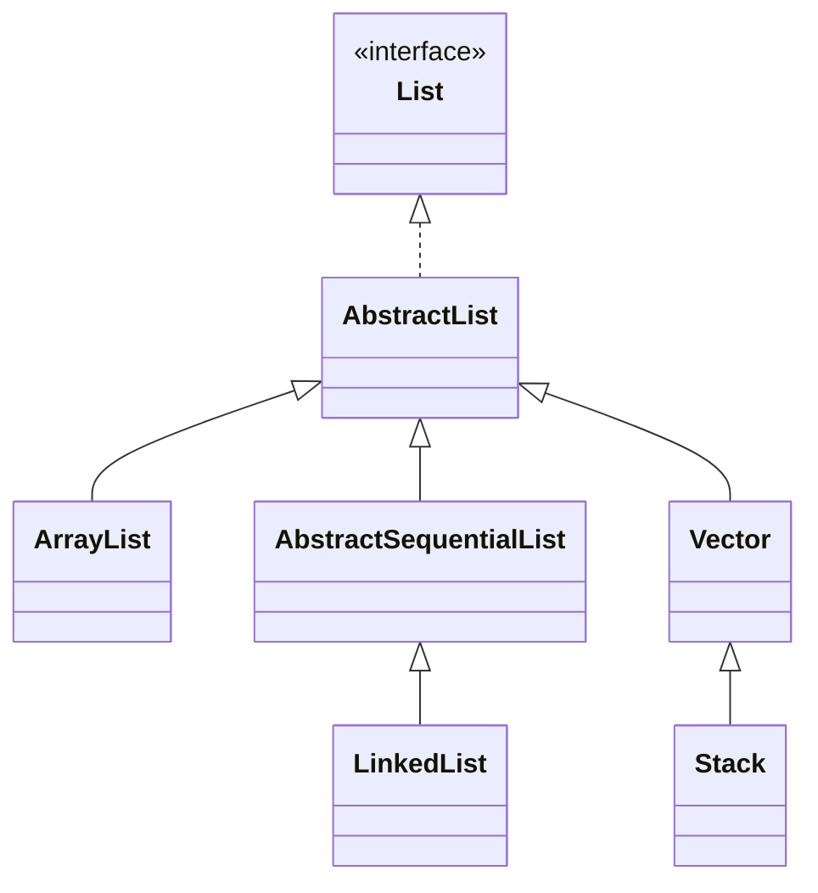
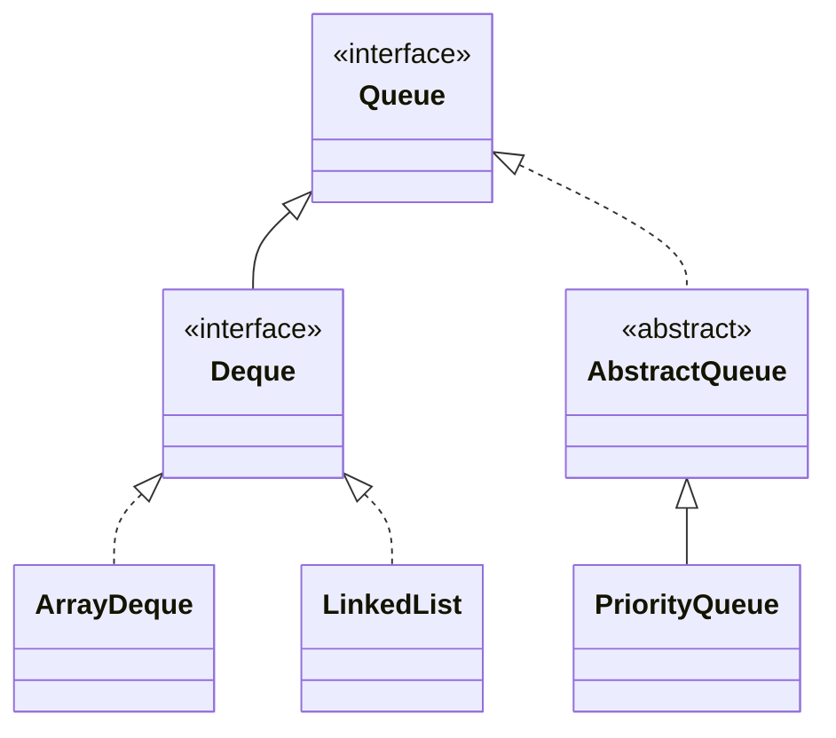
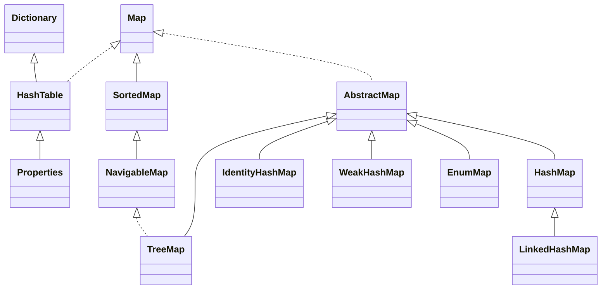
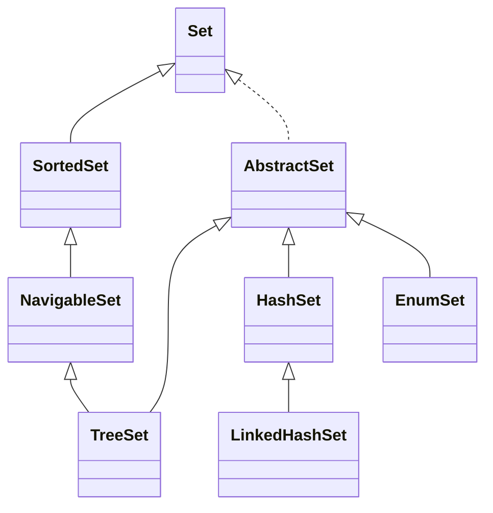

## <center>1.1 基础</center>

### 基本数据类型

| 类型     | 字节 |
| -------- | ---- |
| byte     | 1    |
| short    | 2    |
| int      | 4    |
| long     | 8    |
| **char** | 2    |
| float    | 4    |
| double   | 8    |


### BitSet
BitSet 内部维护了一个 long[] words, 顺序地表示 1 到 (words.length * 64)  
> 每个long占用64位


### Object function
- registerNatives() 类被加载的时候，调用该方法，以完成对其他本地方法的注册
- clone
- equals
- hashCode
- finalize
- toString
- notify
- notifyAll
- wait


### 引用类型  
1. 强引用(永久有效): 只要有强引用指向, 并且GC Roots可达, 那么GC时就不会回收  
2. 软引用(内存不足): OOM前会加入回收范围; 主要用来缓存服务器中间计算结果和不需要实时保存的用户行为等  
3. 弱引用(再次YGC): 指向的对象在下一次YGC时回收  
4. 虚引用(即时失效): 定义完成后就无法通过该引用获取指向的对象. 使用虚引用的唯一目的是希望能在回收时收到系统的通知. 必须与引用队列联合使用, 回收对象内存前会把虚引用加入引用队列中.  


### exception error
exception能被程序本身可以处理，error是程序本身无法处理的。
error通常是虚拟机运行错误

### 受检异常和非受检异常
受检异常：编译时的异常  
非受检异常：RuntimeException和Error


## <center>1.2 集合</center>

### <center>List</center>

- ArrayList  
初始化size=0, add后变成**10**, 1.5倍扩容  

- LinkedList  
双向链表, 头插 | 尾插  

**线程安全的**
- CopyOnWriteArrayList 读的时候不加锁，写的时候加锁复制容器副本，写入并修改其引用
- Collections.synchronizedList(List list) 
- Vector  跟ArrayList类似, 大部分方法被synchronized修饰, 2倍扩容

### <center>Queue</center>

- Queue  
    Queue 一端进一端出  
    Deque 两端均可进出  

    Queue interface 方法:(在空间不足的情况下)

    | runtime exception | no runtime exception |
    | ----------------- | -------------------- |
    | add(E)            | offer(E)             |
    | remove()          | poll()               |
    | element()         | peek()               |

- ArrayDeque  
    - 可扩容数组  
    - 不可存null  
    - 头尾操作高效，通过修改头尾的索引进行操作。
      > head不一定总是大于tail  
    - 内存效率好  

- LinkedList  
    可存null

### <center>Map</center>


- HashMap  
  - 各版本实现方式  
    - 1.7 数组+单链表 
      > 如果一个桶中的元素过多，查询效率就是O(n)  

      1.7 Entry  
      1.7 使用头插法(认为后来的值查找可能性大)  
      > 多线程状态下有可能出现环形链表  

    - 1.8 数组+(单链表|红黑树) 查询效率最差是O(logn)        
      1.8 Node  
      1.8 使用尾插法  
  
  - JDK1.8 关键参数&扩容  
    - 初始化
      ```java
      static final int tableSizeFor(int cap) {
        int n = cap - 1;
        n |= n >>> 1;
        n |= n >>> 2;
        n |= n >>> 4;
        n |= n >>> 8;
        n |= n >>> 16;
        return (n < 0) ? 1 : (n >= MAXIMUM_CAPACITY) ? MAXIMUM_CAPACITY : n + 1;
      }
      ```
    - putVal:
      > 如果table空，resize()
        如果桶里面没有数据，放进去
        如果第一个节点哈希值一样且key一样，说明已经在里面了
        else if 是树节点，往树中添加节点
        else if 是链表，从头到尾遍历，如果没有冲突就放到尾节点（如果大于等于8树形化）
        判断阈值是否要扩容
    - removeNode:
      > 计算index, 如果为空返回null
        如果第一个节点就是, 记录第一个节点
        如果不是, 且next不为null, 判断第1个节点是树节点还是链表节点, 分别进行查找
        最后根据情况删除 
    - resize:
      > if旧容量不为0, 两倍扩容;并且容量到16, 新阈值也加倍
        else if旧容量为0, 旧阈值不为0, 新容量=旧阈值
        else if旧容量为0, 旧阈值为0, 那么都变成默认的    
        if 新阈值为0 (只有旧容量小于16或者旧容量0&阈值不为0的两种情况下出现), 变成默认的
        遍历旧table, 重新做hash散列 


    - 容量
      初始化容量16  
      loadFactor=0.75  
      threshold = capacity * loadFactor = 12
      2倍扩容  

    - (单链表长度 >= 8) & (数组长度 >= 64) 变成红黑树  
      > TREEIFY_THRESHOLD 桶的树化阈值 8  
      > MIN_TREEIFY_CAPACITY 最小树形化容量 64  

    - 红黑树node数量 <= 6 变成单链表  
      > UNTREEIFY_THRESHOLD 树的链表还原阈值 6  
    
  - 桶的树形化 treeifyBin()
    1. 根据Hash表中的元素个数决定是扩容还是树形化
    2. 遍历桶中的元素创建相同个数的树型节点，由单链表转为双链表再转为树形
    3. 让桶的第一个元素指向新建的树头结点  
    
  - put()  
    扩容 首先检测阈值, 扩容成2倍, 重新计算数组中的index = key.hash & (length-1)  
    index = (n-1)&hash, n是数组长度, 是2的幂次方, 则n-1=11111  
    扩容为2倍的情况下，原来的index会在原位置或原位置+原table长度的位置  
    ```
    n-1:    0000 0000 1111
    hash1:  0101 0101 0101  ->  0101
    hash2:  0101 0100 0101  ->  0101

    n-1:    0000 0001 1111
    hash1:  0101 0101 0101  ->  1 0101
    hash2:  0101 0100 0101  ->  0 0101
    ```  

  - 多线程环境下的问题  
    1.7 多线程调用，resize的时候有可能出现环形链表或者数据丢失:  
    未resize之前的节点B在resize的时候头插，而之前这个节点被它之前的节点A指向。这是1.7线程不安全最大的问题之一。  
    1.8 的get/put也没有加同步锁，无法保证多线程操作时上一时刻放进去的值get出来还原值。


### <center>Set</center>

Set是基于Map实现的，map里面的value是：private static final Object PRESENT = new Object();
- LinkedHashSet 加了一条双向链表  
- TreeSet 红黑树，可以有序地组织数据  
