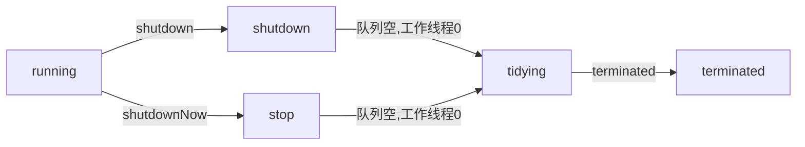

## <center>1.4 多线程</center>  

### sleep() wait()
Thread.sleep()
this.wait()
最主要的区别: sleep()不释放锁 wait()释放锁
wait() notify()只有syncronized内部可调用, 只能由monitor当前持有的锁对象调用, 否则IllegalMonitorStateException


### 线程状态
| 状态         | 说明                         |
| ------------ | ---------------------------- |
| NEW          | 线程构建后未调用start()      |
| RUNNABLE     | 就绪&运行 统称runnable       |
| BLOCKED      | 阻塞于锁                     |
| WAITING      | 等待，等待其他线程通知或中断 |
| TIME_WAITING | 超时等待                     |
| TERMINATED   | 终止，线程执行完毕           |


### 线程中断
interrupt 优雅地中断线程是一种艺术。类似一种标志位，让线程自己中断。
1. interrupt 中断操作时，非自身打断需要先检测是否有中断权限，这由jvm的安全机制配置；
2. 如果线程处于sleep, wait, join 等状态，那么线程将立即退出被阻塞状态，并抛出一个InterruptedException异常；
3. 如果线程处于I/O阻塞状态，将会抛出ClosedByInterruptException（IOException的子类）异常；
4. 如果线程在Selector上被阻塞，select方法将立即返回；
5. 如果非以上情况，将直接标记 interrupt 状态；

Future.cancel()
ExecutorService.shutdown()


### 死锁
一组线程被阻塞了，等待一个永远不会为真的条件。每个线程都在等待其他线程执行一个不可能执行的操作。
如何避免：给定所有互斥操作的一个全序，如果每个线程都以一种顺序获得互斥锁并且以相反的顺序释放，就不会死锁。（CSAPP）
> 产生死锁必须具备以下四个条件：
> 1. 互斥条件：该资源任意一个时刻只由一个线程占用。
> 2. 请求与保持条件：一个进程因请求资源而阻塞时，对已获得的资源保持不放。
> 3. 不剥夺条件: 线程已获得的资源在未使用完之前不能被其他线程强行剥夺，只有自己使用完毕后才释放资源。
> 4. 循环等待条件: 若干进程之间形成一种头尾相接的循环等待资源关系。


### synchronized
解决多个线程之间**访问资源的同步性**, 保证它所修饰的方法或者代码块在任意时刻只能有一个线程执行.
> 1.6之前是重量级锁, 因为监视器锁（monitor）是依赖于底层的操作系统的 Mutex Lock 来实现的，Java 的线程是映射到操作系统的原生线程之上的。如果要挂起或者唤醒一个线程，都需要操作系统帮忙完成，而操作系统实现线程之间的切换时需要从用户态转换到内核态，这个状态转换需要相对比较长的时间

三种使用方式:
1. 修饰方法:
  1.1 实例方法: 相当于对当前对象加锁, 需要获得对象锁
  1.2 静态方法: 相当于给当前类对象加锁, 需要获得类锁
  **同步方法使用 ACC_SYNCHRONIZED 标识**, JVM检测到之后进行同步调用.

2. 修饰代码块: 指定加锁对象, 需要获得相对应的对象锁或者类锁
   > 通过查看字节码信息 
   > javap -c -s -v -l SynchronizedDemo.class

   可以看出同步代码块**使用 monitorenter(指向开始) 和 monitorexit(指向结束) 指令**, 执行enter时尝试持有对象监视器monitor
   > (HotSpot中每个对象都内置一个ObjectMonitor对象//HotSpot中，Monitor是基于 C++ 实现的)  

   执行enter时尝试获取对象锁, 锁计数器为0表示可获取, 获取后锁计数器+1  
   执行exit后将锁计数器设为0, 表示锁已释放.  

本质都是对对象监视器 monitor 的获取.


### 锁的四种状态
无锁状态 偏向锁状态 轻量级锁状态 重量级锁状态
锁升级过程：无锁状态，持有偏向锁的线程不会主动释放锁，二次进入也不需要重新获取锁，等出现锁竞争的时候会变成轻量级锁，轻量级锁通过**CAS自旋处理锁竞争**，自旋次数到达一定程度以后变成重量级锁，使用操作系统的监视器锁
1.6后synchronized优化
https://www.cnblogs.com/wuqinglong/p/9945618.html


### synchronized 和 ReentrantLock 的区别
二者都是可重入锁: 自己可以再次获得自己内部锁, 每次获取锁计数器都会自增1
synchronized依赖**jvm**, ReentrantLock依赖**API**
ReentrantLock **需要手动**加锁、释放，自旋锁，通过循环调用CAS操作实现加锁。
ReentrantLock 高级功能:
1. 等待可中断: 可以中断等待锁的线程, lock.lockInterruptibly()
2. 可实现公平锁: 可指定是公平锁还是非公平锁(通过构造方法)
3. 可实现选择性通知: 在一个Lock对象中可以创建多个Condition实例, 线程可以注册到指定的Condition中, 可以有选择性地进行线程通知.


### CAS Compare and Swap
    轻量级 不加互斥锁  
    并发量大时对CPU消耗大, 有可能产生忙循环  
    ABA问题, 第三者改回最初的状态, 可以通过添加版本号解决


### volatile
#### CPU缓存
先复制到CPU缓存中, 运算完成后回刷主存. 存在不一致问题

#### JMM内存模型
线程可以将变量保存在本地内存(如CPU的寄存器), 而不是主存(共享内存). 产生不一致问题
volatile 防止JVM指令重排&&保证变量的可见性

#### 原子性 可见性 有序性及其相关问题
- 内存屏障: 禁止指令重排 //写之前, 读之后不可重排 & 写完读也不可重排
  当第二个操作是volatile写, 不可重排, 防止写之前的操作被重排到写之后
  当第一个操作是volatile读, 不可重排, 防止读之后的操作被重排到读之前  
  当第一个是volatile写, 第二个是volatile读, 不可重排

- 总线嗅探: 每个处理器通过嗅探总线上传播的数据检查自己的缓存是否过期, 如果处理器发现自己缓存行对应的内存地址被修改, 会将处理器的缓存行设置为无效状态，并从主内存重新获取数据. 

- 总线风暴: 由于volatile的mesi缓存一致性协议需要不断的从主内存嗅探和cas不断循环无效交互导致总线带宽达到峰值
  解决办法：部分volatile和cas使用synchronize

#### volatile 和 synchronized 之间的区别
修饰对象不同, 修饰变量 和 修饰方法&代码块
解决变量在多个线程之间的可见性, 解决多个线程之间访问共享资源的同步性  


### ThreadLocal
copy calue into every thread 设计的初衷是跨线程传递数据；常用方式：通过这玩意儿透传数据，避免方法之间返回值参数等耦合。
```
Thread {
  ThreadLocal.ThreadLocalMap threadLocals = null;
}
ThreadLocal {
  static class ThreadLocalMap {
    static class Entry extends WeakReference< ThreadLocal<?> >{
        // Entry本身持有ThreadLocal对象(弱Weak引用)和Object对象(强引用)
    }
  }
}

```
一个Thread独享一个ThreadLocal.ThreadLocalMap, 一个map有多个entry, Entry的"key"是threadLocal的弱引用, Entry的"value"是Object. ThreadLocal只是作为一个key, 它只被Entry持有
内存泄漏和高并发下脏数据情况, ThreadLocal用完后要调用remove()
- 内存泄漏：ThreadLocal对象通常是静态的，即便是弱引用也不会在下一次YGC时回收，那就无法使Value跟着回收（Value是在Key==null条件下,触发get/set方法置为null） 
- 脏数据：线程复用情况下，没有调用remove()，导致Thread共享到脏数据


### Runnable Callable区别
需要返回结果或抛出异常，用callable.  
工具类 Executors 可以实现 Runnable 对象和 Callable 对象之间的相互转换。
Executors.callable(Runnable task) 或 Executors.callable(Runnable task，Object resule)  


### execute()方法和 submit()方法的区别
execute()方法用于提交不需要返回值的任务，所以无法判断任务是否执行成功
submit()方法用于提交需要返回值的任务。线程池会返回一个 Future 类型的对象，通过这个 Future 对象可以判断任务是否执行成功
> 与上面的Callable配合使用


### 线程池  
- 构成: 核心线程数 最大线程数 阻塞队列 饱和策略  
- 构造函数  
```
  public ThreadPoolExecutor(int corePoolSize, //核心线程数
                            int maximumPoolSize, //最大线程数
                            long keepAliveTime, //超过核心线程的存活时间
                            TimeUnit unit, //时间单位
                            BlockingQueue<Runnable> workQueue, //阻塞队列
                            ThreadFactory threadFactory, //工厂
                            RejectedExecutionHandler handler //拒绝策略
                            );
```

- 运行机制: 核心线程满-> 阻塞队列满-> 线程池满-> 拒绝策略  
- 拒绝策略:  
  - CallerRunsPolicy: 交由调用方执行  
  - AbortPolicy: 抛出RejectedExecutionException异常  
  - DiscardPolicy: 丢弃  
  - DiscardOldestPolicy: 丢弃最早未处理的任务  
- 阻塞队列  
  - 无界队列  
  - 有界队列  
  - 同步移交(相当于没有队列)  条件是有线程在等待接收队列中的元素; 如果没有线程等待接收, 那么会创建新的线程处理; 然而又超过了最大的线程数限制那会根据饱和策略丢弃;

- 线程超时会被标记为可回收, 超过核心线程数, 被标记的会被中止. 
  > 注意这里的核心线程池里的线程不会被标记, 可以通过设置核心线程可超时处理
- 线程数设置:  
  计算密集型的CPU核心数+1;  
  线程数=目标利用率 * CPU核心数 * (1+等待时间/使用时间)

线程池运行状态5种
| 状态       | 描述                      |
| ---------- | ------------------------- |
| running    | 可接任务，也可处理队列    |
| shutdown   | 不接任务，仍可处理队列    |
| stop       | 中断正在处理的线程        |
| tidying    | 所有任务终止，有效线程数0 |
| terminated | 结束                      |




### Atomic 类
**4类: 基本类型, Array, Reference, Updater**
**基本类型**
使用原子的方式更新基本类型

- AtomicInteger：整形原子类
- AtomicLong：长整型原子类
- AtomicBoolean：布尔型原子类

**数组类型**
使用原子的方式更新数组里的某个元素

- AtomicIntegerArray：整形数组原子类
- AtomicLongArray：长整形数组原子类
- AtomicReferenceArray：引用类型数组原子类

**引用类型**

- AtomicReference：引用类型原子类
- AtomicStampedReference：原子更新带有版本号的引用类型。该类将整数值与引用关联起来，可用于解决原子的更新数据和数据的版本号，可以解决使用 CAS 进行原子更新时可能出现的 ABA 问题。
- AtomicMarkableReference ：原子更新带有标记位的引用类型

**对象的属性修改类型**
更新对象的属性必须 public volatile 修饰
- AtomicIntegerFieldUpdater：原子更新整形字段的更新器
- AtomicLongFieldUpdater：原子更新长整形字段的更新器
- AtomicReferenceFieldUpdater：原子更新引用类型字段的更新器


### AtomicInteger原理
利用 CAS, volatile 和 native 方法来保证原子操作
拿期望的值和原本的一个值作比较，如果相同则更新成新的值。
UnSafe 类的 objectFieldOffset() 方法是一个本地方法，这个方法用来拿到“原来的值”的内存地址，返回值是(long) valueOffset。另外 value 是一个 volatile 变量，在内存中可见，因此 JVM 可以保证任何时刻任何线程总能拿到该变量的最新值。


-----------


### AQS
java.util.concurrent.locks.AbstractQueuedSynchronizer; 
是一个构建锁和同步器的框架，能构造出大量同步器 (Lock就是用了这个
内部维护了volitile int state代表共享资源，一个FIFO封装线程的双向阻塞队列

#### AQS原理
如果被请求的资源空闲，则将当前请求资源的线程设置为有效的工作线程，并将共享资源锁定。
如果被请求的资源被占用，那么需要一套阻塞等待唤醒机制保证锁的分配。AQS通过CLH队列锁实现，将暂时获取不到锁的线程加入队列。
> CLH：Craig、Landin and Hagersten队列，是单向链表，AQS中的队列是CLH变体的虚拟双向队列（FIFO），AQS是通过将每条请求共享资源的线程封装成一个节点来实现锁的分配。

#### AQS共享资源的方式
- 独占：只有一个线程能执行，比如ReetrantLock，又可分为公平锁和非公平锁
  - 公平锁：按照线程在队列中的顺序，先到者拿到锁
  - 非公平锁：无视队列顺序，两次CAS争抢锁
- 共享：多个线程可同时执行

#### AQS 公平锁非公平锁
非公平锁在调用 lock 后，首先就会调用 CAS 进行一次抢锁，如果这个时候恰巧锁没有被占用，那么直接就获取到锁返回了。
非公平锁在 CAS 失败后，和公平锁一样都会进入到 tryAcquire 方法，在 tryAcquire 方法中，如果发现锁这个时候被释放了（state == 0），非公平锁会直接 CAS 抢锁，但是公平锁会判断等待队列是否有线程处于等待状态，如果有则不去抢锁，乖乖排到后面。

#### ReentrantLock实现原理
state资源状态计数。state初始化为0，表示未锁定状态，A线程lock()时，会调用 tryAcquire() 独占锁并将state+1。其他线程 tryAcquire() 就会失败，直到A线程unlock()到state=0为止。在释放锁之前A线程可以重复获取这个锁，state状态会累加，这就是可重入。

#### AQS组件
- Semaphore 允许多个线程同时访问
- CountDownLatch  协调多个线程的同步，可以让某线程等待倒计时结束再开始执行
- CyclicBarrier 跟倒计时器类似，它是让一组线程达到一个屏障时被阻塞，直到最后一个线程到达屏障时被拦截的线程才能继续工作

#### CountDownLatch
任务分为N个子线程执行，state初始化为N，子线程是并行执行的，每个子线程执行完后countDown()一次，state会CAS，减一。等到state=0，会unpark()主线程，主线程会从await()返回，继续后续操作。

#### countDownLatch使用
预估多个任务费用的时候, 有10条线程并行执行, 每条线程执行完任务后countDown, 最后await等待所有线程执行完毕后统一返回结果
可以用CompletableFuture改进

#### AQS 阻塞队列
怎么实现的 都有哪几个状态。各个状态什么含义 有什么用
通过内部类Node封装线程，并且维护pre、next和waitStatus信息实现双向队列
waitStatus状态：
1. CANCELLED=1 取消状态，表示线程获取锁的请求已经取消了，如节点获取锁超时。
2. SIGNAL=-1 表示线程已经准备好了，等到资源释放
3. CONDITION=-2 表示节点在等待队列中，节点线程等待唤醒
4. PROPAGATE=-3 当前线程处于共享情况下才会使用
5. 0 初始化

####  AQS条件队列
是啥 有什么用
每个Condition都有一个条件队列
单向链表，阻塞队列的暂存


#### AQS响应中断
本质是运行的线程能够从阻塞中唤醒并执行完毕。
1 线程能从阻塞中唤醒，AQS使用LockSupport.park(this)阻塞线程。而此方法是支持中断。
2 线程能执行完毕正常退出，只有获取同步状态才能正常退出自旋循环。需要退出就需要在中断时抛出异常。


-----------------------------


### ConcurrentHashMap  
    1.7 底层是分片数组  
    有Segment分段锁, 继承于ReentrantLock, 每次只给一段加锁保证并发度  
    1.8 底层跟HashMap一致, 使用synchronized和CAS  


### 乐观锁 悲观锁
乐观默认别人不会修改，更新的时候会判断是否被其他操作修改过，如果修改过会重试。版本号、CAS等
悲观锁默认别人会修改，会先对资源进行加锁处理


重入锁源码
Aqs源码

CountdownLatch
